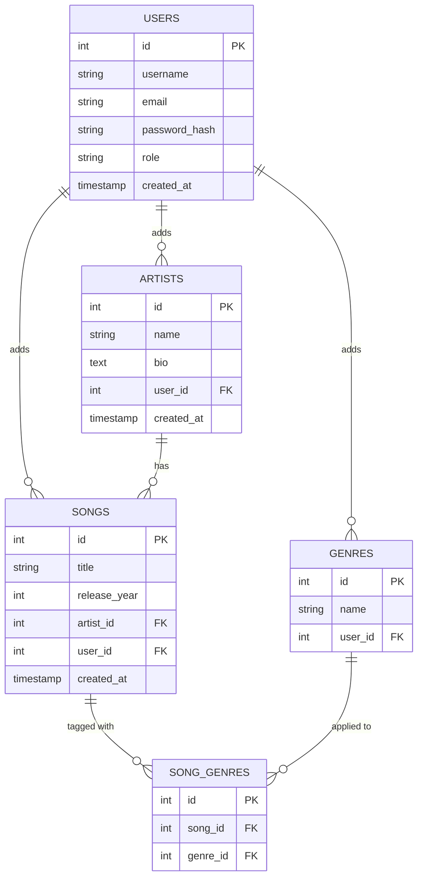

# Entity Relationship Diagram

## List of Tables

- **users** — accounts for both regular users and admins
- **artists** — music artists added by a user to their favorites
- **songs** — songs added by a user, each belonging to one artist
- **genres** — music genres added by a user to their favorites
- **song_genres** — join table linking songs to genres (many-to-many)

---

## Entity Relationship Diagram

---

## Table Schemas

### users
| Column Name   | Type      | Description                        |
|---------------|-----------|------------------------------------|
| id            | integer   | primary key                        |
| username      | text      | unique display name                |
| email         | text      | unique email address               |
| password_hash | text      | hashed password                    |
| role          | text      | `'user'` or `'admin'`              |
| created_at    | timestamp | account creation date              |

### artists
| Column Name | Type      | Description                          |
|-------------|-----------|--------------------------------------|
| id          | integer   | primary key                          |
| name        | text      | name of the artist                   |
| bio         | text      | short biography (optional)           |
| user_id     | integer   | foreign key → users.id               |
| created_at  | timestamp | date added to favorites              |

### songs
| Column Name  | Type      | Description                          |
|--------------|-----------|--------------------------------------|
| id           | integer   | primary key                          |
| title        | text      | title of the song                    |
| release_year | integer   | year the song was released           |
| artist_id    | integer   | foreign key → artists.id             |
| user_id      | integer   | foreign key → users.id               |
| created_at   | timestamp | date added to favorites              |

### genres
| Column Name | Type    | Description                          |
|-------------|---------|--------------------------------------|
| id          | integer | primary key                          |
| name        | text    | name of the genre (e.g. "Hip-Hop")   |
| user_id     | integer | foreign key → users.id               |

### song_genres *(join table)*
| Column Name | Type    | Description                          |
|-------------|---------|--------------------------------------|
| id          | integer | primary key                          |
| song_id     | integer | foreign key → songs.id               |
| genre_id    | integer | foreign key → genres.id              |

---

## Relationships Summary

| Relationship | Type | Description |
|---|---|---|
| users → artists | One-to-Many | A user can add many artists to their favorites |
| users → songs | One-to-Many | A user can add many songs to their favorites |
| users → genres | One-to-Many | A user can add many genres to their favorites |
| artists → songs | One-to-Many | An artist can have many songs |
| songs ↔ genres | Many-to-Many | A song can belong to many genres; a genre can apply to many songs (via `song_genres`) |
