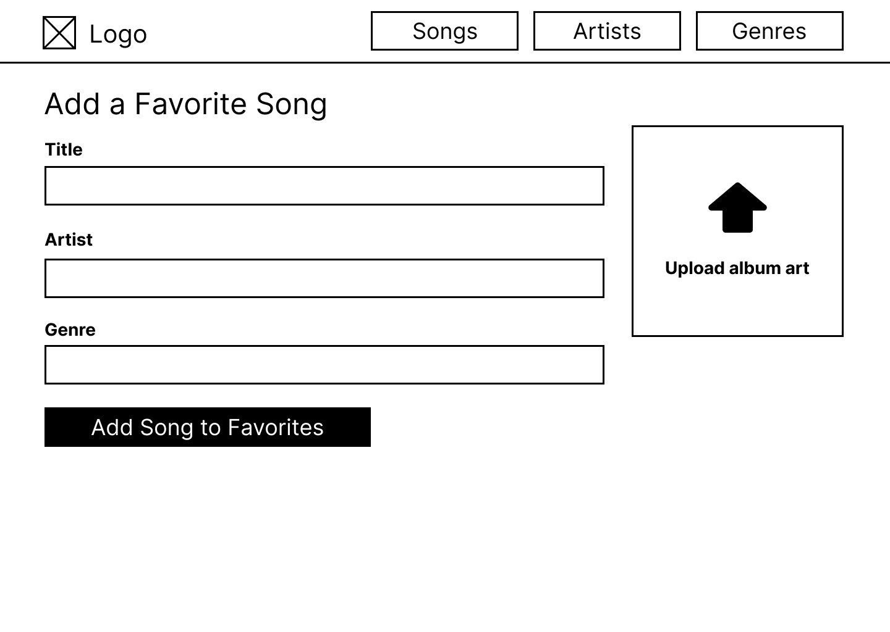

# Recommended Tunes
*Your Music. Your Taste. Discovered.*

**Team:** Jonathan Hill · Jacob Solano · Semir Ali · Richard Selznick

CodePath WEB103 · Final Project

---

## The Problem

**You love music. Keeping track of it is a mess.**

- Playlists get cluttered and disorganized
- No easy way to log your favorite artists, songs, and genres in one place
- Existing apps don't let you build a fully custom favorites list the way *you* want it

---

## Our Solution

**A personal music favorites manager — built by you, for you.**

- Add your favorite **songs**, **artists**, and **genres** to one place
- **Edit or remove** entries any time
- The app analyzes your taste to surface music you might love next

---

## Key Features

| Feature | What it does |
|---|---|
| Add Song / Artist / Genre | Build your personalized favorites list |
| Edit Entries | Correct mistakes or update details |
| Delete Entries | Keep your list clean and current |
| User Accounts | Each user has their own private favorites |
| Admin Controls | Admins can manage accounts to keep the platform healthy |

---

## Technical Design

**Full-stack web app with a RESTful API**

**Frontend:** React + React Router

**Backend:** Node.js / Express

**Database:** PostgreSQL

**API Routes:** GET · POST · PATCH · DELETE for songs, artists, and genres

**Key relationships:**
- A user owns many songs, artists, and genres
- An artist has many songs
- Songs can belong to many genres *(many-to-many)*

---

## Wireframe — Favorite Songs

---

## Wireframe — Add a Song

---

## Wireframe — Add an Artist

---

## Roadmap & What's Next

**Where we are:**
- ✅ Planning complete (user stories, wireframes, ERD)

**Coming next:**
- Build the Express API (routes for songs, artists, genres)
- Stand up the PostgreSQL database with relationships
- Build React frontend with React Router navigation
- Connect frontend to backend and deploy on Render

**Our goal:** A fully deployed, working app by the end of the course.
